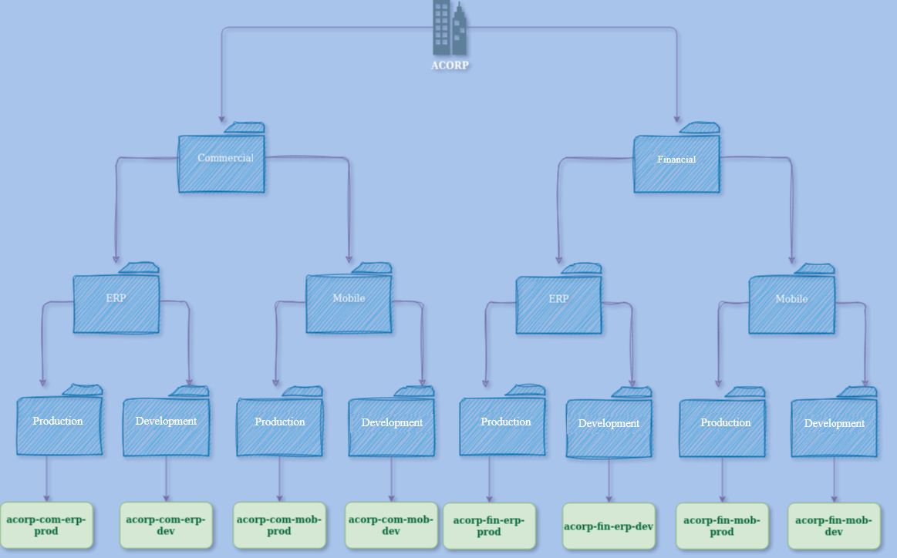
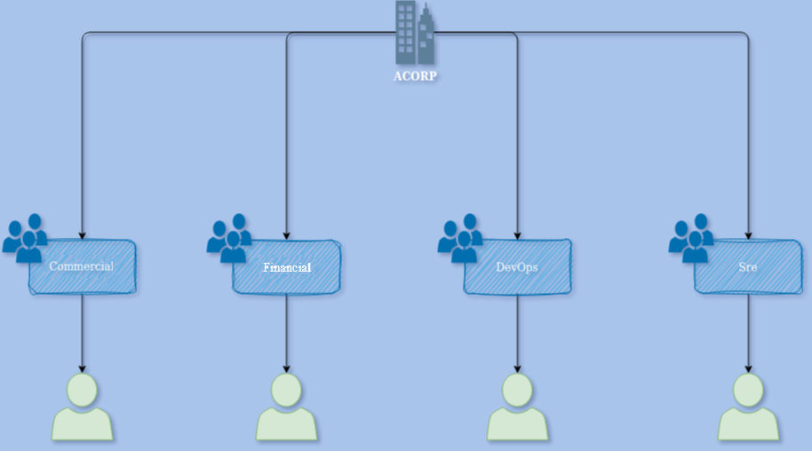

Daily learning

# Designing Your Folder and Project Organization and Access Groups on Google Cloud Platform

Project developed at the Bootcamp Cloud DevOps Experience - Banco Carrefour with guidance from specialist [Carlos Gomes](https://www.linkedin.com/in/carlos-barbero-95457b22/ "Carlos Gomes").
Learning how to build a diagram of an organizational structure and its access group to improve understanding of creating cloud projects.

- Project design with folder structure:

- Drawing project groups:

[LICENSE](/LICENSE)
